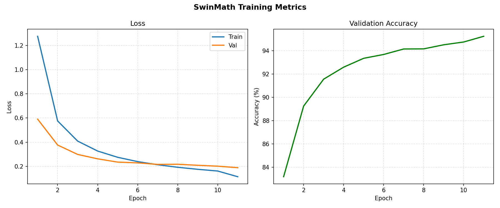
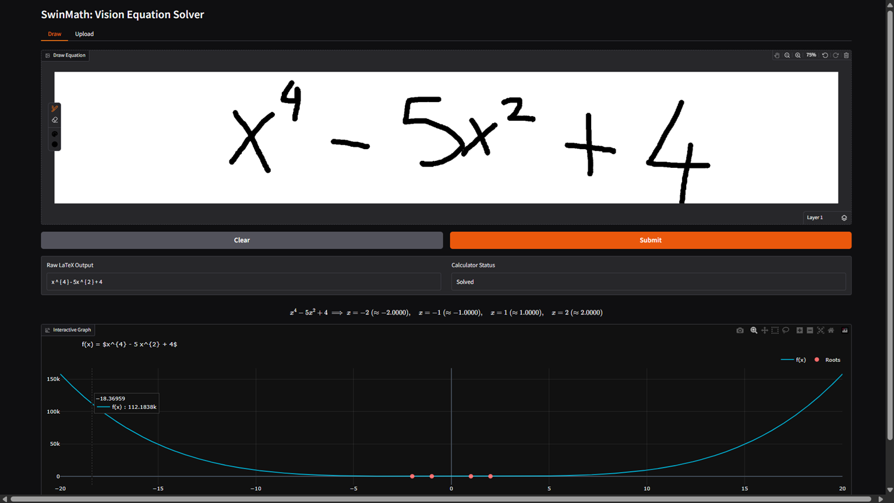
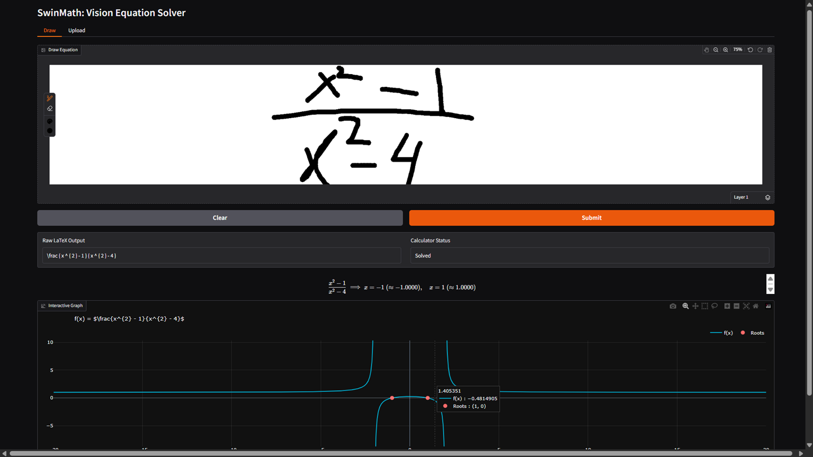
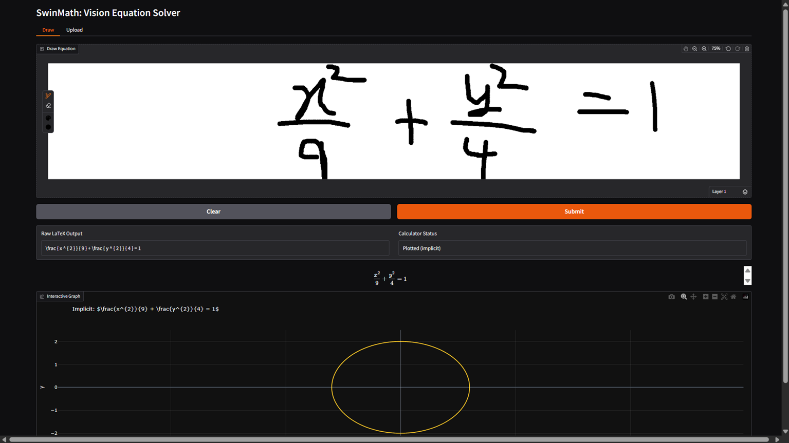
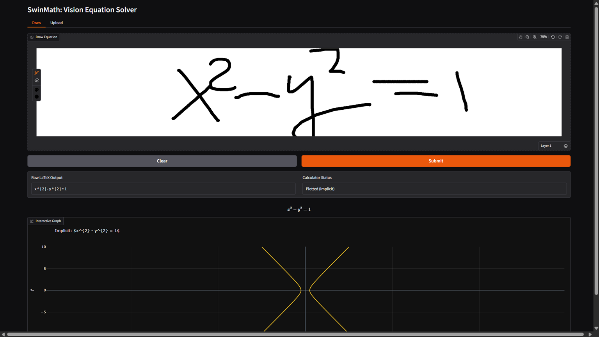
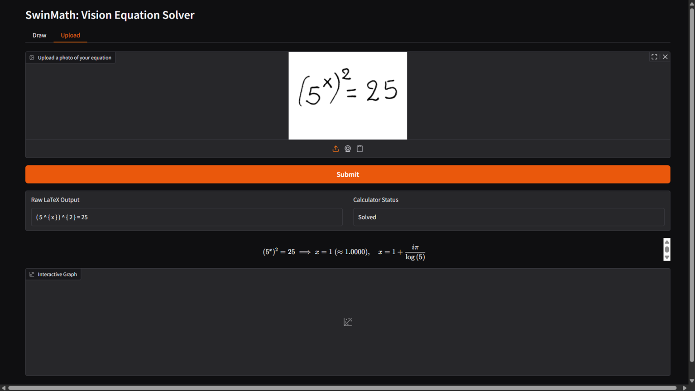
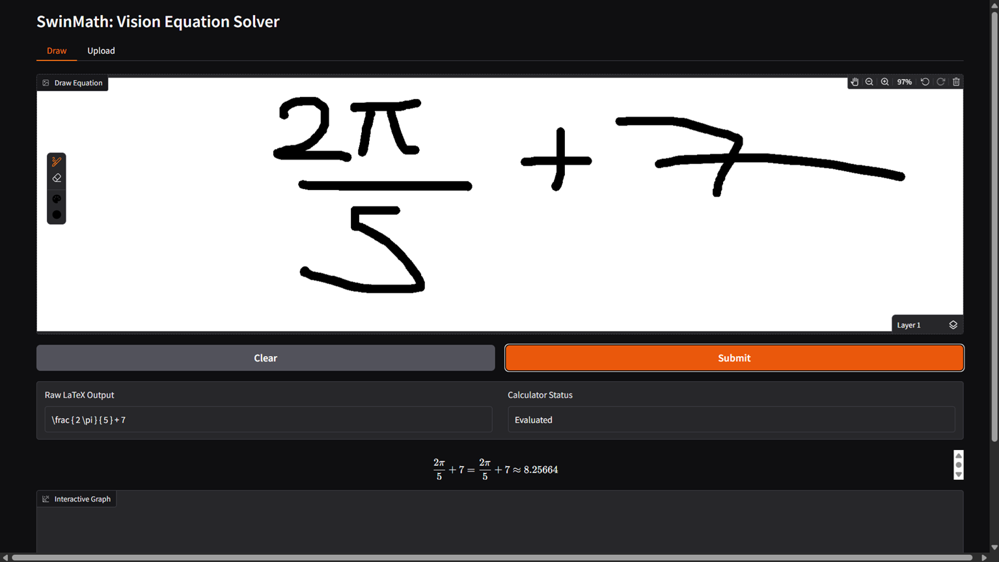

# SwinMath

A handwritten equation solver. Draw or photograph a math expression and get the LaTeX, solution, and an interactive graph.

   


---

## How it works

The input image is preprocessed (auto-crop, contrast stretch, binarize) then passed to a Swin V2-T encoder. A Transformer decoder autoregressively predicts the LaTeX token sequence. The resulting expression is parsed by SymPy which solves or simplifies it and generates an interactive Plotly graph.

For single-variable expressions the graph is explicit. For two-variable equations like `x² + y² = 1` an implicit contour plot is used instead.

---

## Model

| Component | Details |
|---|---|
| Encoder | Swin Transformer V2-T (pretrained ImageNet) |
| Projection | Linear 768 → 256 |
| Decoder | 4-layer Transformer, d_model=256, 8 heads |
| Dropout | 0.3 |
| Input size | 256 × 256 (padded, white background) |

---

## Dataset

Trained on [HME100K](https://www.kaggle.com/datasets/cutedeadu/hme100k) — a large-scale real-world handwritten math expression dataset with 74,502 training images across 249 symbol categories, collected from tens of thousands of writers via camera capture.

---

## Training



```bash
python scripts/prepare_data.py   # splits into train/val/test CSVs
python scripts/build_vocab.py    # builds vocab.json
python src/train.py              # trains and saves checkpoints
python scripts/plot_metrics.py   # plots metrics.csv
```

---

## Examples

**Quartic - four real roots**


**Rational - two asymptotes**


**Ellipse - implicit contour**


**Hyperbola - implicit contour**


**Exponent equation**


**Constant evaluation**
